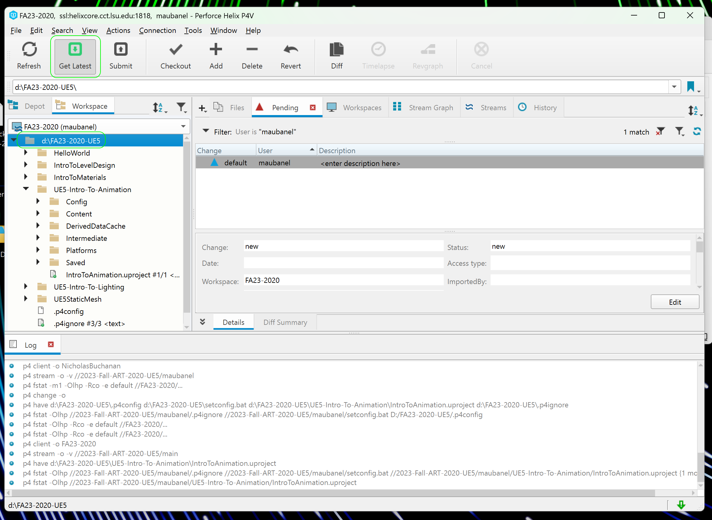
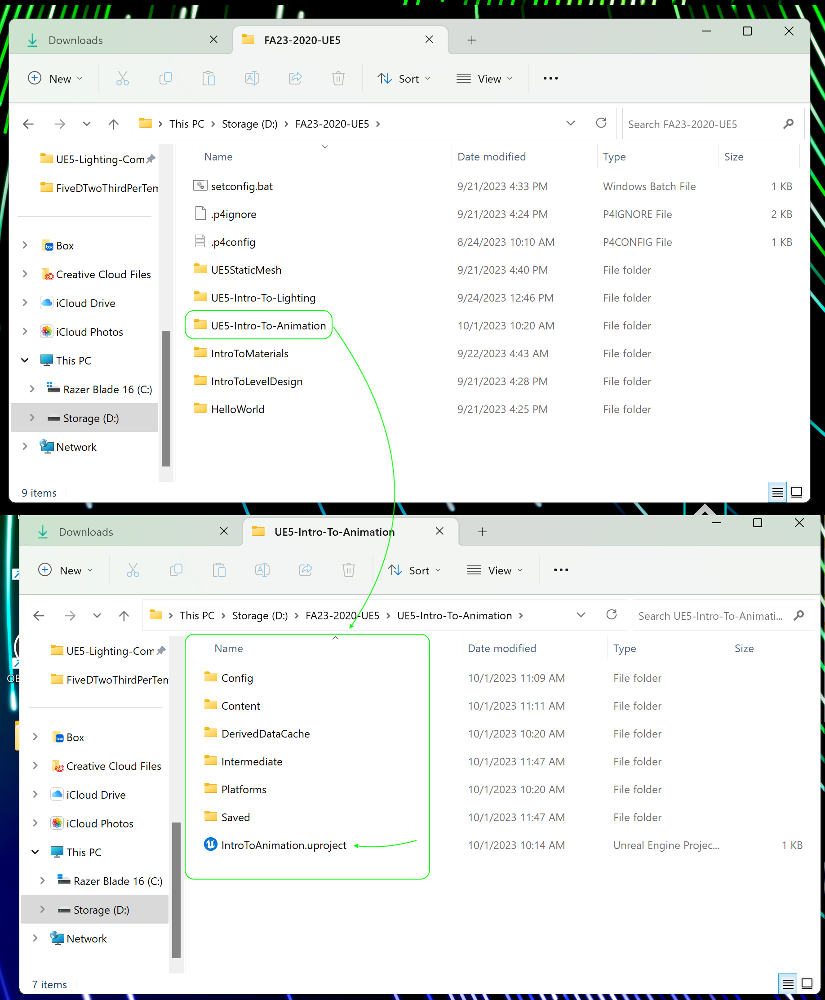
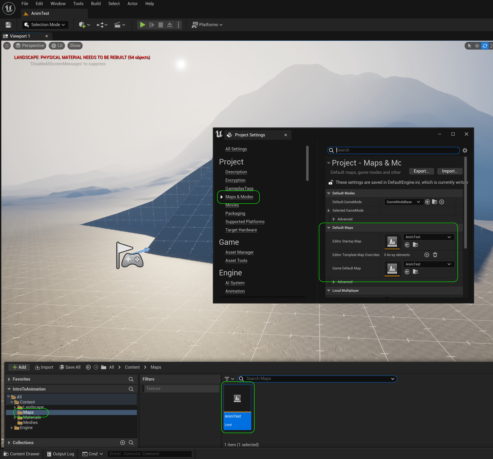
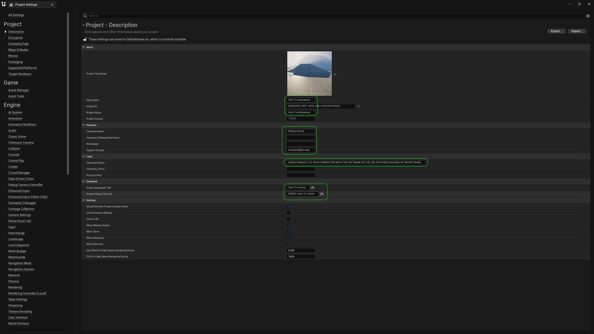

### Setting Up

[home](../README.md#user-content-ue4-animations) • [next](../character-anim/README.md#user-content-download-character--animations)

Lets get set up with the sample project provided and get it ready to start importing animations ASAP.

 

---

| `required.software`\|`UE5 Animaton`| 
| :--- |
| :floppy_disk: &nbsp; &nbsp; You will need to install the latest version of _UE5 5.0.X_ by downloading the [Epic Games Launcher](https://www.epicgames.com/store/en-US/download). You will also need a [P4V](https://www.perforce.com/downloads/helix-visual-client-p4v) account which is free to sign up for as we will be using version control. Lets make sure you can see hidden folders. On the PC follow these [Windows 10 Turn on Hidden Folders](https://support.microsoft.com/en-us/help/4028316/windows-view-hidden-files-and-folders-in-windows-10) directions.|

##### `Step 1.`\|`ITA`|:small_blue_diamond:

In Perforce select your top folder and press the <kbd>Get Latest</kbd> button and you will get a **UE5-Intro-To-Animation** folder.

##### `Step 2.`\|`ITA`|:small_blue_diamond: :small_blue_diamond: 

Now run the project from either Perforce or your Windows Explorer.

##### `Step 3.`\|`ITA`|:small_blue_diamond: :small_blue_diamond: :small_blue_diamond:

Open up **Maps | Anim Test** level. Open up **Edit | Project Settings** and select **Maps & Modes | Default Maps** and change both the **Editor Startup Map** and the **Game Default Map** to `AnimTest`.

##### `Step 4.`\|`ITA`|:small_blue_diamond: :small_blue_diamond: :small_blue_diamond: :small_blue_diamond:

Now in project settings description set the **Description** and **Project Name**.  I filled in the **Company Name** and **Support Contact**.  Then I used the [MIT License](https://opensource.org/license/mit/) and added my name and the year 2023.  I suggest you pick a licensing type to use as well recommned using MIT if you want others to interact with your work.  I also added a **Project Dipsplayed Title** and **Project Debug Title Info**. 

##### `Step 5.`\|`ITA`| :small_orange_diamond:

Press the <kbd>Play</kbd> button and look at the character.  You are controlling the default player pawn (like a spectator pawn) with no third person character.  We will fix that soon.

https://github.com/maubanel/UE5-Animations/assets/5504953/13f813c7-c007-4b52-bc99-b0e624a55737

##### `Step 6.`\|`ITA`| :small_orange_diamond: :small_blue_diamond:

Select the **File | Save All** then quit UE5.   Go to **P4V** and go the top project folder (the one that holds the `.uproject` file and **Content** folder) and press the <kbd>+Add</kbd> then <kbd>OK</kbd> button.  This makes sure any files that Unreal didn't add get added to source control. Press the <kbd>Submit</kbd> button and enter a message explaining the work done.  Press <kbd>Submit</kbd>.

___

<!--  -->

| [home](../README.md#user-content-ue4-animations) | [next](../character-anim/README.md#user-content-download-character--animations)|
|---|---|
