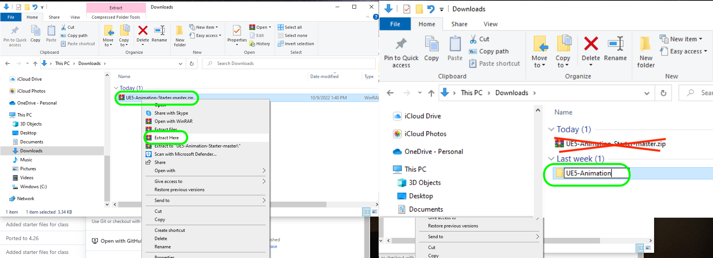

### Setting Up

[home](../README.md#user-content-ue4-animations) • [next](../character-anim/README.md#user-content-download-character--animations)

Lets get set up with the sample project provided and get it ready to start importing animations ASAP.

 

---

| `required.software`\|`UE5 Animaton`| 
| :--- |
| :floppy_disk: &nbsp; &nbsp; You will need to install the latest version of _UE5 5.0.X_ by downloading the [Epic Games Launcher](https://www.epicgames.com/store/en-US/download). You will also need a [P4V](https://www.perforce.com/downloads/helix-visual-client-p4v) account which is free to sign up for as we will be using version control. Lets make sure you can see hidden folders. On the PC follow these [Windows 10 Turn on Hidden Folders](https://support.microsoft.com/en-us/help/4028316/windows-view-hidden-files-and-folders-in-windows-10) directions.|

##### `Step 1.`\|`ITA`|:small_blue_diamond:

Got to [Github Animation Starter](https://github.com/maubanel/GMS2-Animation-Starter](https://github.com/LSU-UE5/UE5-Animation-Starter) and select <kbd>Code</kbd> then **Download ZIP**.

##### `Step 2.`\|`ITA`|:small_blue_diamond: :small_blue_diamond: 
Right click on the downloaded file and select **Extract Here**.  This decompresses the `.zip` file so you can use it.  Rename the new unzipped folder to `UE5-Animations`.

##### `Step 3.`\|`ITA`|:small_blue_diamond: :small_blue_diamond: :small_blue_diamond:

Delte `.gitattributes`, `.gitignore` and `README.md`. We do not need these. There is a **LICENSE** file that declares the copyright and licensing terms. You can look at this if you like and make any changes to your liking. The **README.txt** file has temporary text that you need to keep updated. You also have a **.p4ignore** file that keeps binaries and files that are not required out of the Perforce repository. 

##### `Step 4.`\|`ITA`|:small_blue_diamond: :small_blue_diamond: :small_blue_diamond: :small_blue_diamond:

Move the **UE5-Animation** folder to the root of your **Perforce** directory (should be the name of your **Workspace**).

___

<!--  -->

| [home](../README.md#user-content-ue4-animations) | [next](../character-anim/README.md#user-content-download-character--animations)|
|---|---|
