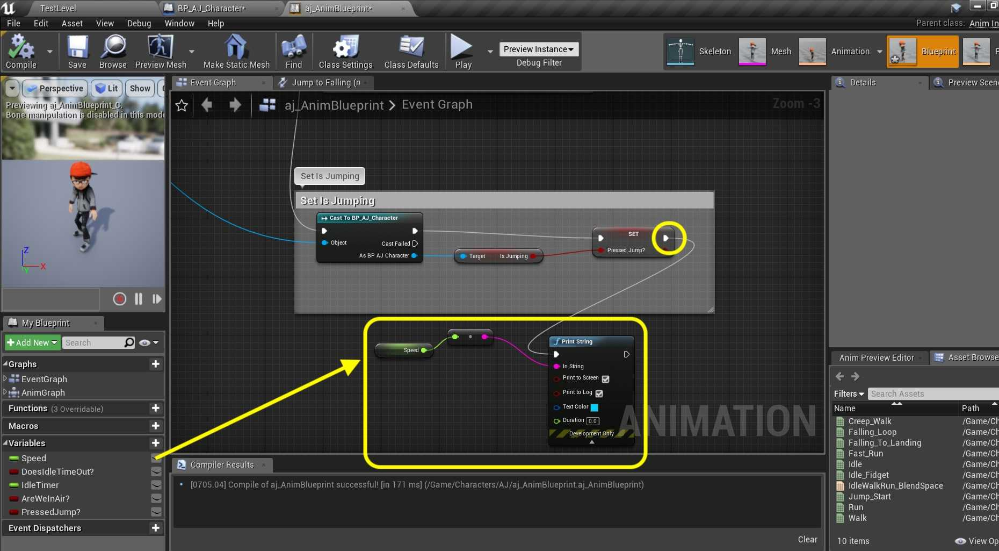
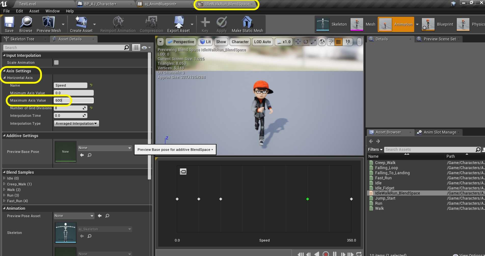
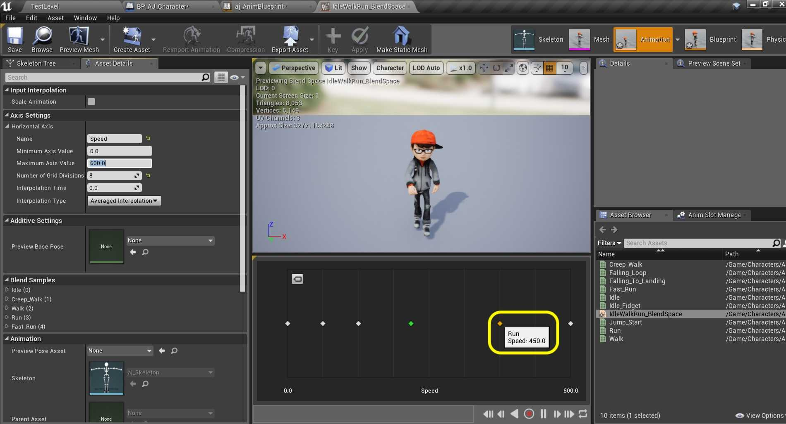
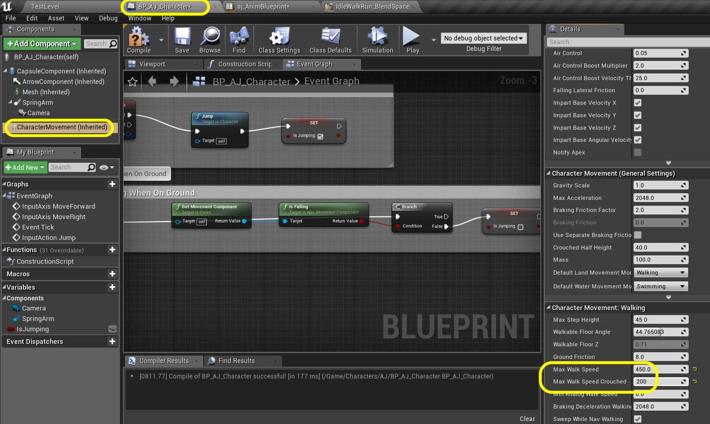
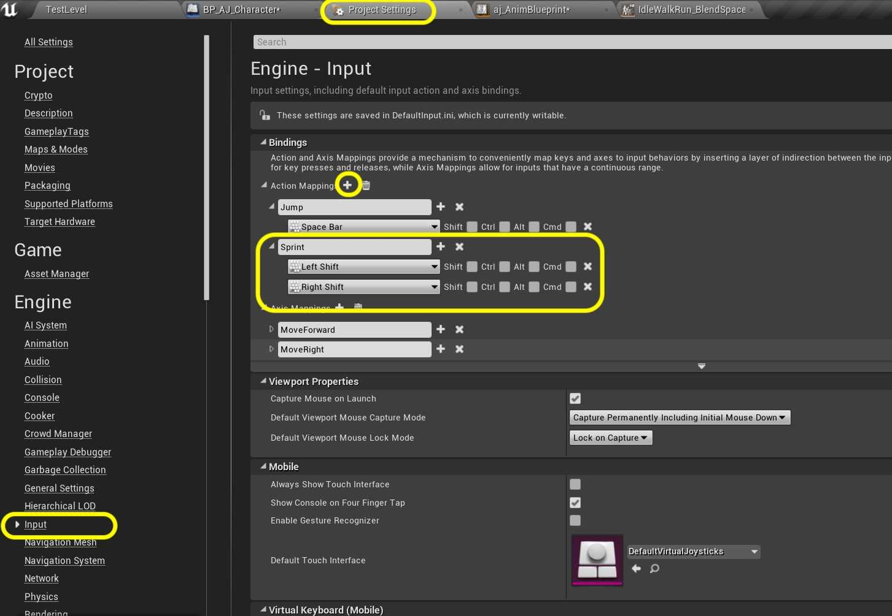
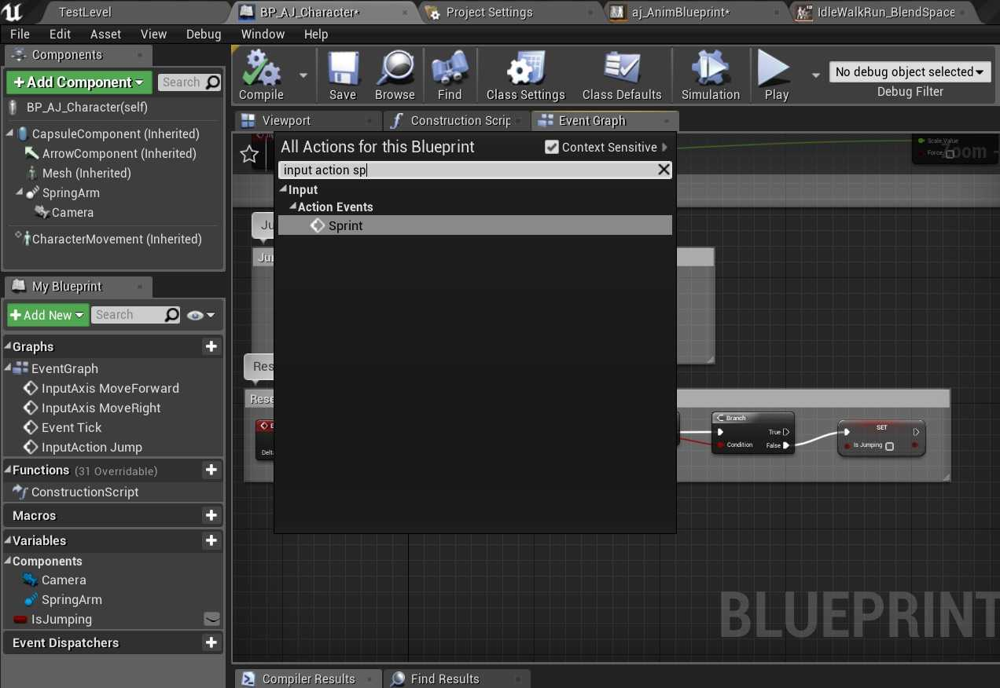
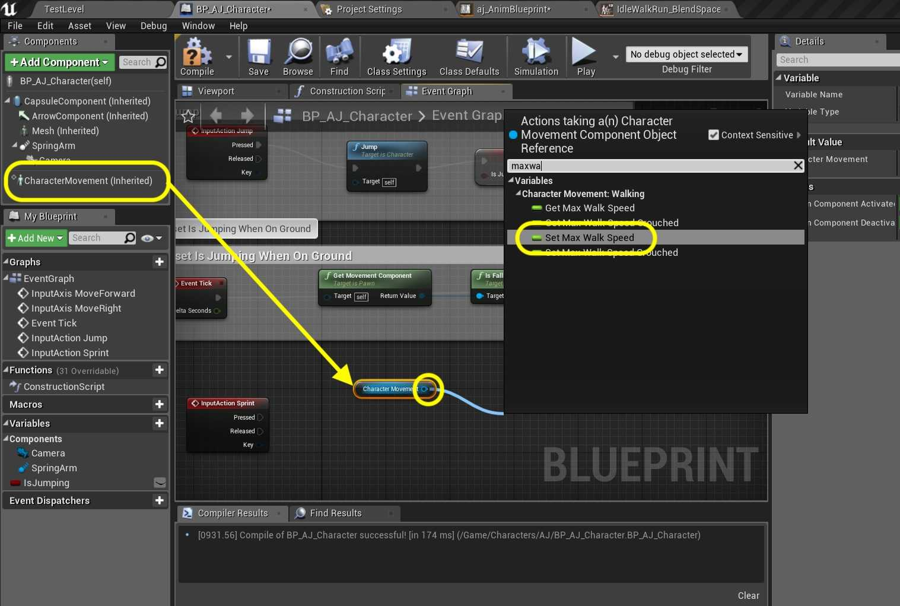
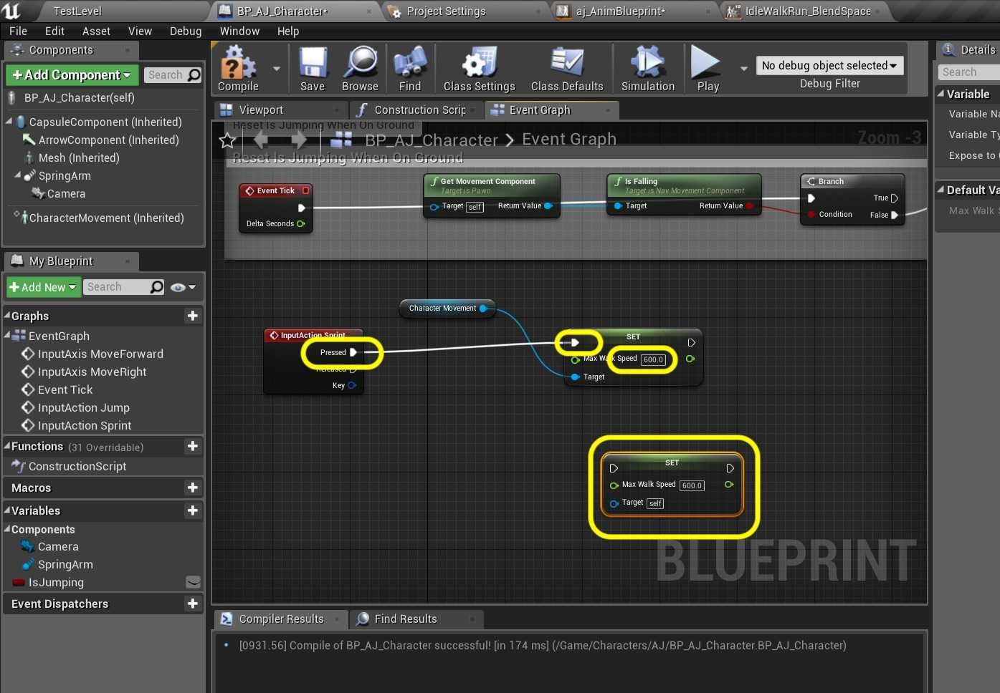
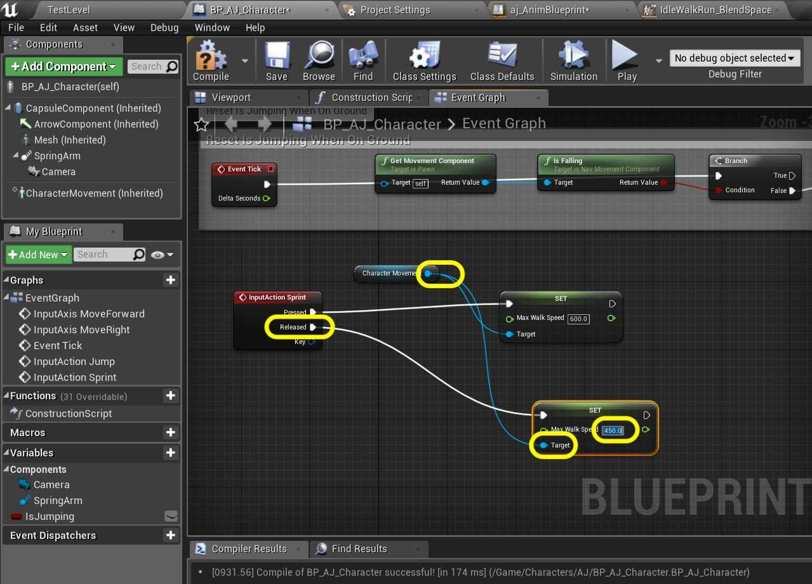
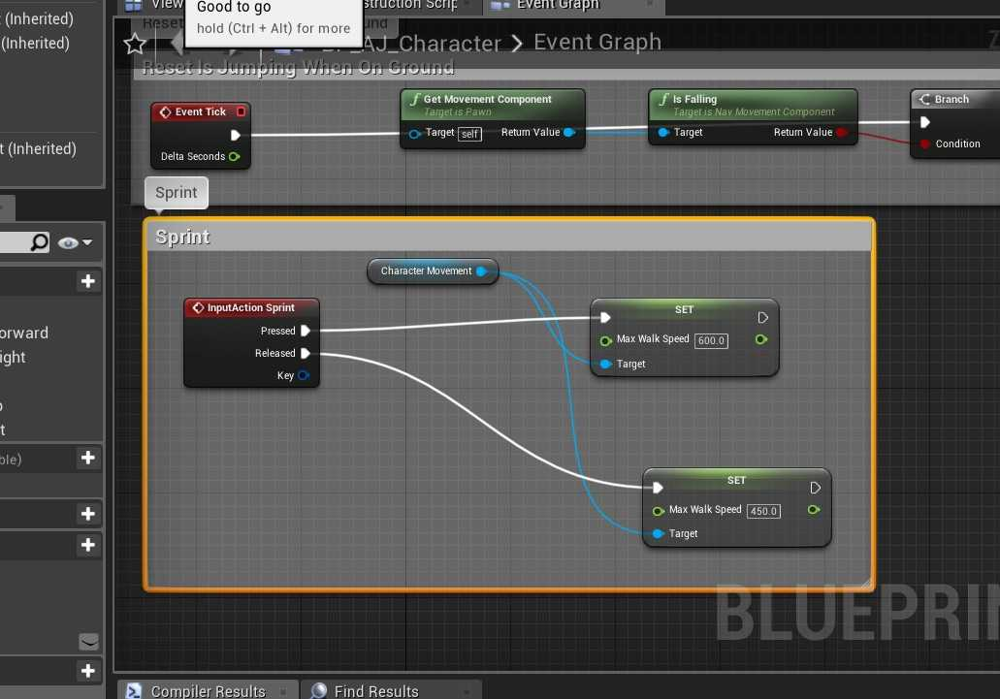

### Slow Walk & Sprint

[previous](../jumping-ii/README.md#user-content-jumping-animation-ii) • [home](../README.md#user-content-ue4-animations) • [next](../double-jump/README.md#user-content-double-jump)

Lets add some speed changes so we can adjust our speed based on a button state change. Lets add a Alt button for slow walk and an Shift button for sprint. Then lets create some platforms to jump around in.

 

---

##### `Step 1.`\|`ITA`|:small_blue_diamond:

So we need to control the speed of the player. Open the **BP_AJ_Character** blueprint and select the **Character Movement** component. In the detail panel look for **Character Movement: Walking | Max Walk Speed**. It is set to `600`. My guess is that this is the same value as the magnitude of the velocity vector. Please take note that the word walking means speed on ground and does not imply an animation state. It is used for all ground movement (not flying or swimming). Set **Max Walk Speed** TO `450`.

##### `Step 2.`\|`FHIU`|:small_blue_diamond: :small_blue_diamond: 

Remember we placed this velocity magnitude in the animation blueprint. Open the **aj_AnimBlueprint | Event Graph** blueprint and add athe bottom of the graph a **Get Speed** node. Add a **Print String** node. *Connect* the output of the **Speed** node to the **In String** of the **Print String** node. Press the arrow at the bottom of the **Print** node and change the **Duration** to `0.0`. *Connect* the execution pin coming from **Set PressedJump** node to the **Print String** node.

##### `Step 3.`\|`ITA`|:small_blue_diamond: :small_blue_diamond: :small_blue_diamond:

*Play* the game. You will noticed that in the turns it ducks below 450 but is at 449 when running straight. So our assumption is correct, this matches the max walking value in the blueprint.

https://user-images.githubusercontent.com/5504953/133072398-b0dc0778-ce74-47d7-902d-b329a9bbcbea.mp4

##### `Step 4.`\|`ITA`|:small_blue_diamond: :small_blue_diamond: :small_blue_diamond: :small_blue_diamond:

Now lets make some adjustments in our blend space. We want our top sprinting speed to be 600 and our normal run at 450 . Open the **IdleWalkRun_BlendSpace** blend in our **Animations** folder. *Click on* **Axis Settings** and change the **Horizontal Axis | Maximum Axis** Value to `600` to match the top speed in game.

##### `Step 5.`\|`ITA`| :small_orange_diamond:

That rescales our graph. So I want to know the speed of our normal run animation. *Click* on the second to last animation and it should have scaled this value to `450.0`.

##### `Step 6.`\|`ITA`| :small_orange_diamond: :small_blue_diamond:

Now go back to the **BP_AJ_Character** blueprint and select the **Character Movement** Component. Then go to **Character Movement Walking | Max Walk Speed** and set it to `450.0` and adjust **Max Walk Speed Crouched** to `200.0`.

##### `Step 7.`\|`ITA`| :small_orange_diamond: :small_blue_diamond: :small_blue_diamond:

*Play* the game. You will noticed that in the player only runs at 450 and the slower run animation plays:

https://user-images.githubusercontent.com/5504953/133072932-ce6d095c-c983-404a-a5ae-528e9a3c2618.mp4

##### `Step 8.`\|`ITA`| :small_orange_diamond: :small_blue_diamond: :small_blue_diamond: :small_blue_diamond:

Lets add sprinting to get the speed back up to 600. We will do this when pressing the <kbd>Shift</kbd> key. Now open **Edit | Project Settings** and go to **Engine | Input**. Press the **+** button next to **Action Mappings** and add a new action and call it **Sprint**. Press the **+** next to the **Sprint** action. *Assign* the `Left Shift` and `Right Shift` keys.

##### `Step 9.`\|`ITA`| :small_orange_diamond: :small_blue_diamond: :small_blue_diamond: :small_blue_diamond: :small_blue_diamond:

Reopen **BP_AJ_Character** blueprint and go to the **Event Graph**. At the bottom add a **Action Events | Sprint** node.

##### `Step 10.`\|`ITA`| :large_blue_diamond:

*Drag and drop* a reference to the **Character Movement** component. *Pull off* of its pin and add a **Set Max Walk Speed** node.

##### `Step 11.`\|`ITA`| :large_blue_diamond: :small_blue_diamond: 

*Connect* the execution pin **Pressed** from the **Sprint** node to the **Set Max Walk Speed** node. *Change* the **Speed** to `600.0`. *Copy and paste* the the **Set Max Walk Speed** node.

##### `Step 12.`\|`ITA`| :large_blue_diamond: :small_blue_diamond: :small_blue_diamond: 

*Connect* the **Character Movement** node to the **Target** input on the pasted **Set Max Walk Speed** node. *Connect* the **Released** execution pin from the **Sprint** node to this node as well. *Change* the **Speed** to `450.0`.

##### `Step 13.`\|`ITA`| :large_blue_diamond: :small_blue_diamond: :small_blue_diamond:  :small_blue_diamond: 

Add a comment with `Sprint` around these nodes.

##### `Step 14.`\|`ITA`| :large_blue_diamond: :small_blue_diamond: :small_blue_diamond: :small_blue_diamond:  :small_blue_diamond: 

*Play* the game. You will noticed that in the player runs at 450 until the sprint button is pressed. Then the player runs at a full 600 with the faster animation.

https://user-images.githubusercontent.com/5504953/133073885-1df2da68-7cf7-4c61-9f42-83865ed76aaf.mp4

##### `Step 15.`\|`ITA`| :large_blue_diamond: :small_orange_diamond: 

##### `Step 16.`\|`ITA`| :large_blue_diamond: :small_orange_diamond:   :small_blue_diamond: 

##### `Step 17.`\|`ITA`| :large_blue_diamond: :small_orange_diamond: :small_blue_diamond: :small_blue_diamond:

##### `Step 18.`\|`ITA`| :large_blue_diamond: :small_orange_diamond: :small_blue_diamond: :small_blue_diamond: :small_blue_diamond:

##### `Step 19.`\|`ITA`| :large_blue_diamond: :small_orange_diamond: :small_blue_diamond: :small_blue_diamond: :small_blue_diamond: :small_blue_diamond:

##### `Step 20.`\|`ITA`| :large_blue_diamond: :large_blue_diamond:

##### `Step 21.`\|`ITA`| :large_blue_diamond: :large_blue_diamond: :small_blue_diamond:

##### `Step 22.`\|`ITA`| :large_blue_diamond: :large_blue_diamond: :small_blue_diamond: :small_blue_diamond:

##### `Step 23.`\|`ITA`| :large_blue_diamond: :large_blue_diamond: :small_blue_diamond: :small_blue_diamond: :small_blue_diamond:

##### `Step 24.`\|`ITA`| :large_blue_diamond: :large_blue_diamond: :small_blue_diamond: :small_blue_diamond: :small_blue_diamond: :small_blue_diamond:

##### `Step 25.`\|`ITA`| :large_blue_diamond: :large_blue_diamond: :small_orange_diamond:

___

| [previous](../jumping-ii/README.md#user-content-jumping-animation-ii)| [home](../README.md#user-content-ue4-animations) | [next](../double-jump/README.md#user-content-double-jump)|
|---|---|---|
