### Slow Walk & Sprint

[previous](../jumping-ii/README.md#user-content-jumping-animation-ii) • [home](../README.md#user-content-ue4-animations) • [next](../double-jump/README.md#user-content-double-jump)

Lets add some speed changes so we can adjust our speed based on a button state change. Lets add a Alt button for slow walk and an Shift button for sprint. Then lets create some platforms to jump around in.

 

---

##### `Step 1.`\|`ITA`|:small_blue_diamond:

So we need to control the speed of the player. Open the **BP_AJ** blueprint and select the **Character Movement** component. In the detail panel look for **Character Movement: Walking | Max Walk Speed**. My guess is that this is the same value as the magnitude of the velocity vector. Please take note that the word walking means speed on ground and does not imply an animation state. It is used for all ground movement (not flying or swimming). Set **Max Walk Speed** TO `450`.

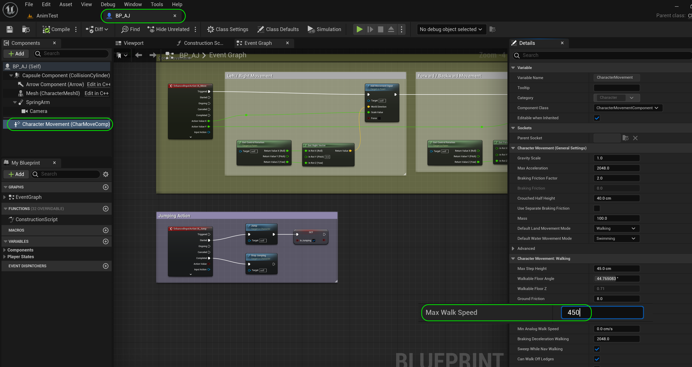

##### `Step 2.`\|`FHIU`|:small_blue_diamond: :small_blue_diamond: 

Remember we placed this velocity magnitude in the animation blueprint. Open the **AnimBP_AJ | Event Graph** blueprint and add to the bottom of the graph a **Get Speed** node. Add a **Print String** node. *Connect* the output of the **Speed** node to the **In String** of the **Print String** node. Press the arrow at the bottom of the **Print** node and change the **Duration** to `0.0`. *Connect* the execution pin coming from **Set PressedJump** node to the **Print String** node.

##### `Step 3.`\|`ITA`|:small_blue_diamond: :small_blue_diamond: :small_blue_diamond:

*Play* the game. You will notice that the running speed is set at 450. So our assumption is correct, this matches the max walking value in the blueprint. Also, it is picking the sprint animation but it doesn't feel like our player is sprinting.  Remember it is the 1D Blend that we have set which animation to run so this is what we would need to adjust to pick a more appropriate animation speed to match the displacement velocity vector we are printing.

https://user-images.githubusercontent.com/5504953/197331731-7adb2d51-b383-48a1-bf95-90b2518a6c1e.mp4

##### `Step 4.`\|`ITA`|:small_blue_diamond: :small_blue_diamond: :small_blue_diamond: :small_blue_diamond:

Since 450 we are runnning the sprint anim but we are not displacing fast enought lets make a change to our **BlendSpace_IdleWalkRun**. Now lets make some adjustments in our blend space. We want our top sprinting speed to be 600 and our normal run at 450 . Open the **IdleWalkRun_BlendSpace** blend in our **Animations** folder. *Click on* **Axis Settings** and change the **Horizontal Axis | Maximum Axis** Value to `600` to match the top speed in game. Now this opens up a greater range at the end to blend from running to sprtinting.

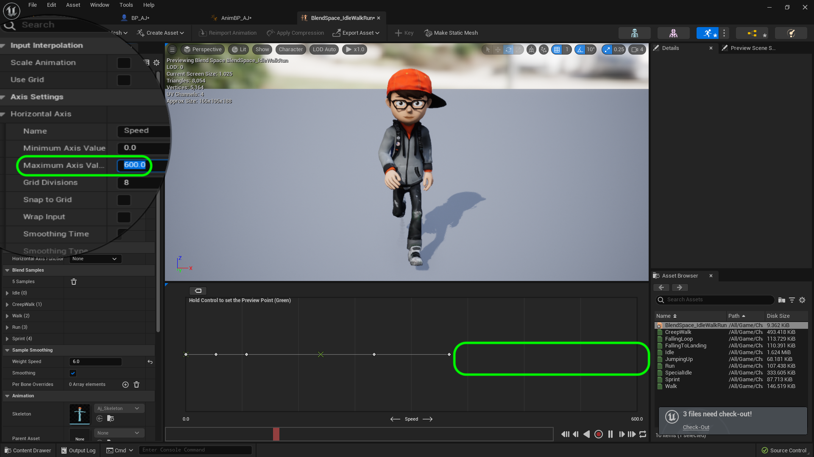

##### `Step 5.`\|`ITA`| :small_orange_diamond:

That rescales our graph. So I want to know the speed of our normal run animation. *Click* on the last animation and change its value to `600.0`, what will be our sprinting speed.

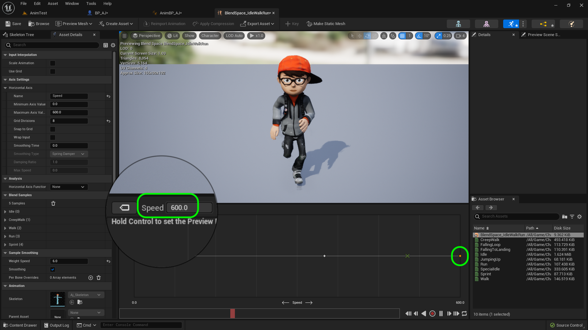

##### `Step 6.`\|`ITA`| :small_orange_diamond: :small_blue_diamond:

Now we need to set our regular run speed to 450. *Click* on the second to last run animation and it *change* this value to `450.0`.

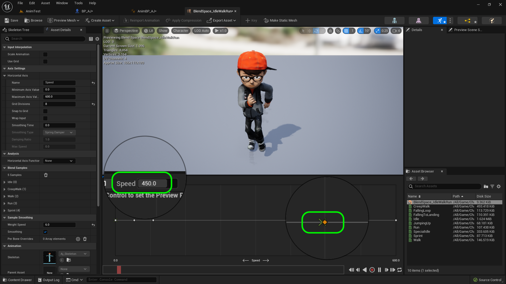

##### `Step 7.`\|`ITA`| :small_orange_diamond: :small_blue_diamond: :small_blue_diamond:

*Play* the game. You will noticed that in the player only runs at 450 and the slower run animation plays:

https://user-images.githubusercontent.com/5504953/197332475-37d6ae45-a7ce-44d5-872f-5566a81714a8.mp4

##### `Step 8.`\|`ITA`| :small_orange_diamond: :small_blue_diamond: :small_blue_diamond: :small_blue_diamond:

Lets add sprinting to get the speed back up to 600. We will do this when pressing the <kbd>Shift</kbd> key. Now open **Edit | Project Settings** and go to **Engine | Input**. Press the **+** button next to **Action Mappings** and add a new action and call it **Sprint**. Press the **+** next to the **Sprint** action. *Assign* the `Left Shift` and `Right Shift` keys. So when we shift run we will sprint!

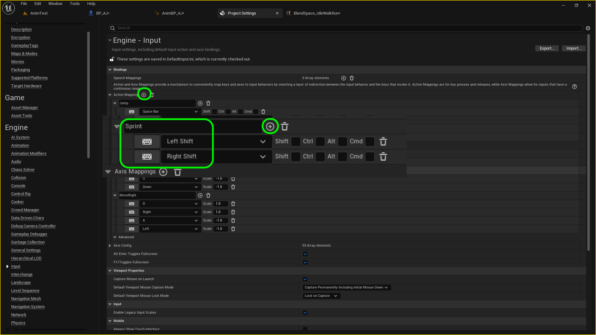

##### `Step 9.`\|`ITA`| :small_orange_diamond: :small_blue_diamond: :small_blue_diamond: :small_blue_diamond: :small_blue_diamond:

Reopen **BP_AJ** blueprint and go to the **Event Graph**. At the bottom add a **Action Events | Sprint** node.

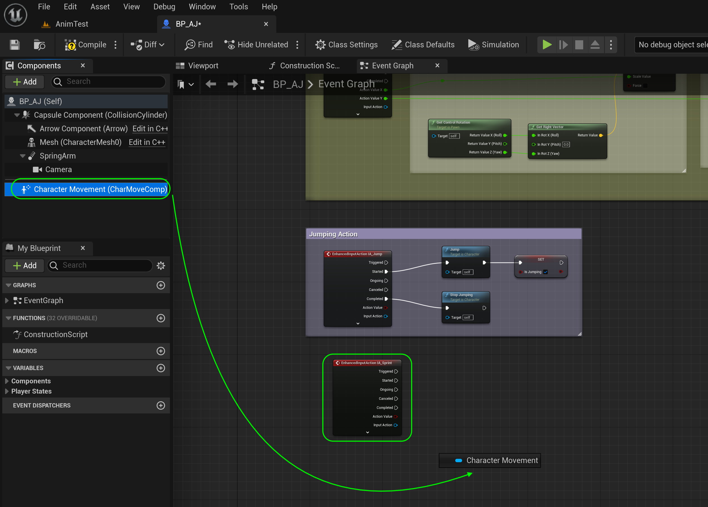

##### `Step 10.`\|`ITA`| :large_blue_diamond:

*Drag and drop* a reference to the **Character Movement** component. *Pull off* of its pin and add a **Set Max Walk Speed** node.

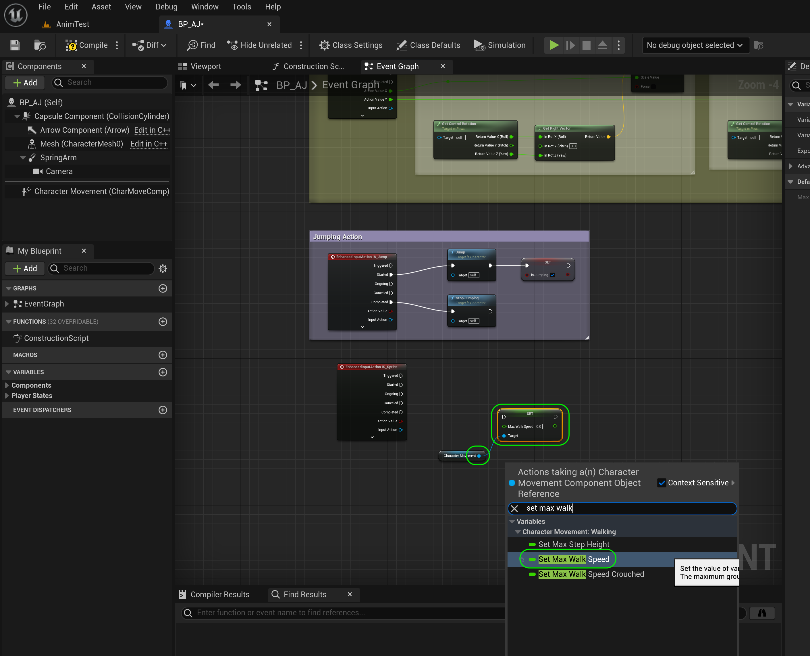

##### `Step 11.`\|`ITA`| :large_blue_diamond: :small_blue_diamond: 

 *Copy and paste* the the **Set Max Walk Speed** node to have a duplicate.

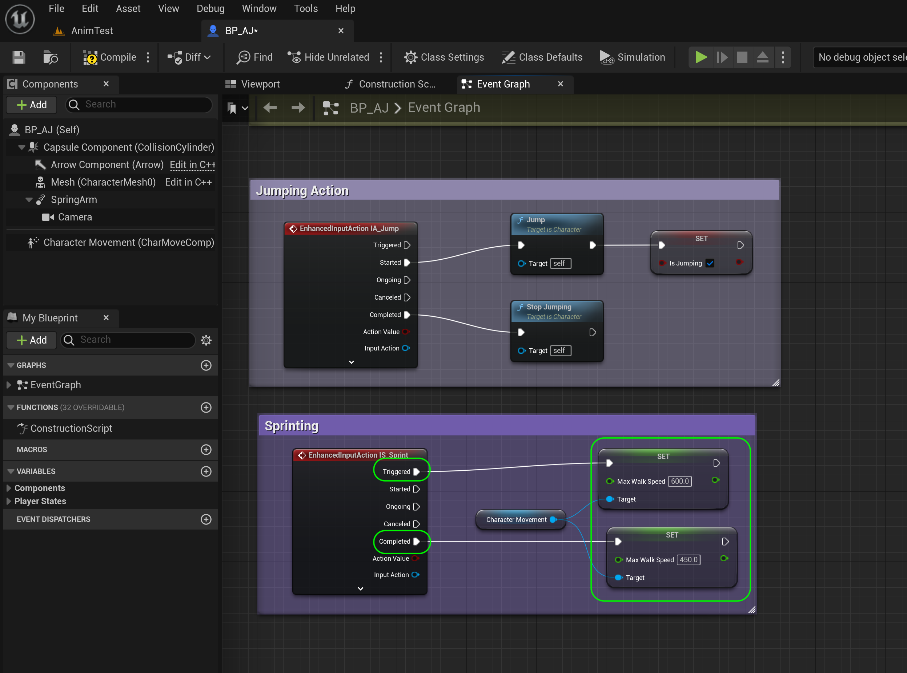

##### `Step 12.`\|`ITA`| :large_blue_diamond: :small_blue_diamond: :small_blue_diamond: 

*Connect* the execution pin **Pressed** from the **Sprint** node to the **Set Max Walk Speed** node.  *Change* the **Speed** to `600.0` so that the speed increases when pressing the shift key. *Connect* the **Released** execution pin from the **Sprint** node to the second **Set Max Walk Speed** node.  *Change* it back to your regular run speed setting **Speed** to `450.0`.

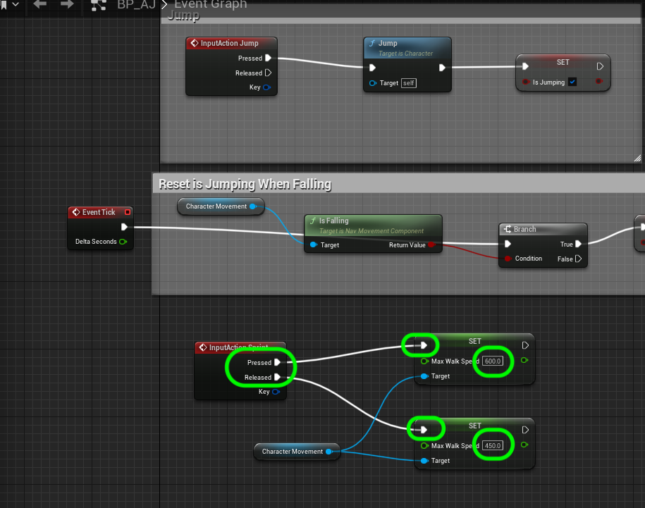

##### `Step 13.`\|`ITA`| :large_blue_diamond: :small_blue_diamond: :small_blue_diamond:  :small_blue_diamond: 

Add a comment with `Sprint` around these nodes.

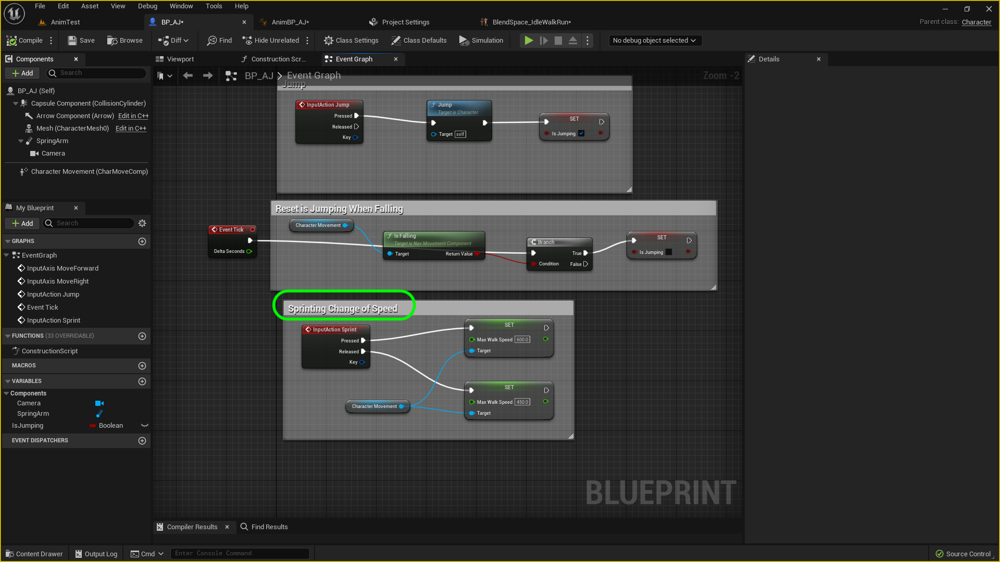

##### `Step 14.`\|`ITA`| :large_blue_diamond: :small_blue_diamond: :small_blue_diamond: :small_blue_diamond:  :small_blue_diamond: 

*Play* the game. You will noticed that in the player runs at 450 until the sprint button is pressed. Then the player runs at a full 600 with the faster animation.

https://user-images.githubusercontent.com/5504953/197333143-ef65aaf6-563f-4218-aad3-5ef144acc5f1.mp4

##### `Step 15.`\|`ITA`| :large_blue_diamond: :small_orange_diamond: 

OK, lets work on the slow walk. Open the **BlendSpace_IdleWalkRun** editor. It is the second option on the left. We can see that it is at ~ `40`.

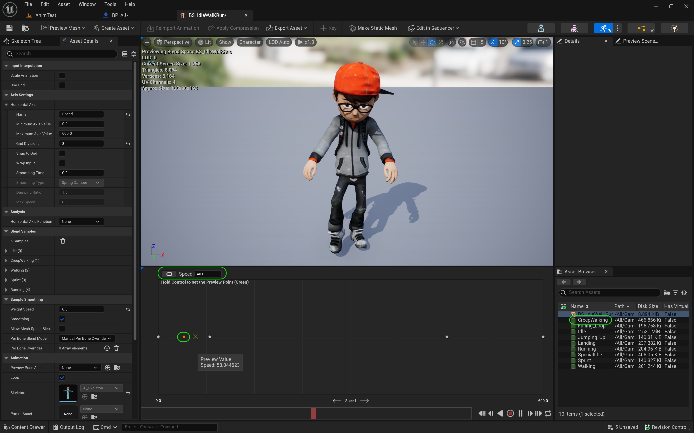

##### `Step 16.`\|`ITA`| :large_blue_diamond: :small_orange_diamond:   :small_blue_diamond: 

Now open **Edit | Project Settings** and go to **Engine | Input**. Press the **+** button next to **Action Mappings** and add a new action and call it `SlowWalk`. Press the **+** next to the **Slow Walk** action. *Assign* the `Left Alt` and `Right` Alt keys.

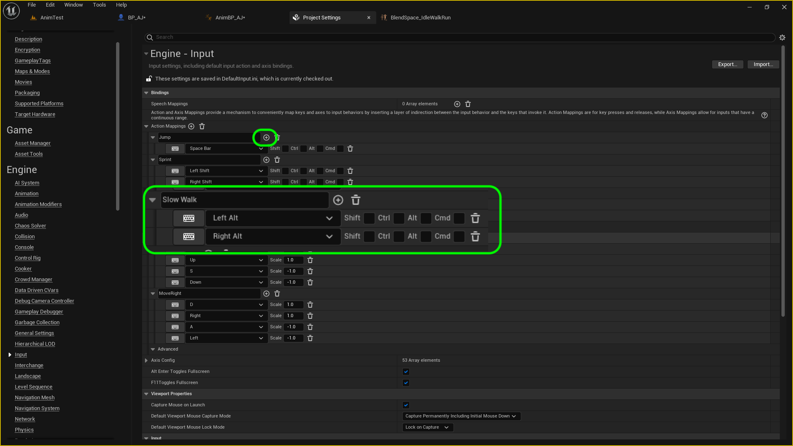

##### `Step 17.`\|`ITA`| :large_blue_diamond: :small_orange_diamond: :small_blue_diamond: :small_blue_diamond:

Go back to the **BP_AJ** blueprint and at the bottom *right click* and add a **Action Event | Slow Walk** node.

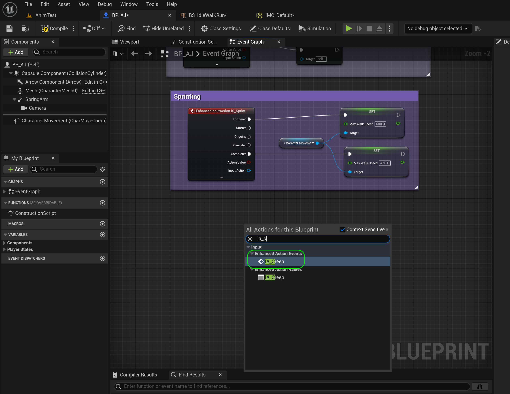

##### `Step 18.`\|`ITA`| :large_blue_diamond: :small_orange_diamond: :small_blue_diamond: :small_blue_diamond: :small_blue_diamond:

*Copy and paste* the **Character Movement** and two **Set** nodes from sprinting and paste them next to the **Slow Walk** node. *Connect* the execution pins. *Change* the **Max Walk Speed** for the **Pressed** node path to `40.0`. *Leave* the **Released** back to `450.0`. Add a comment `Slow Walk` around these new nodes.

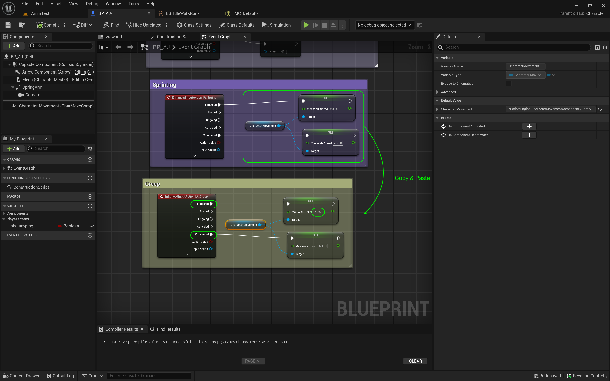

##### `Step 19.`\|`ITA`| :large_blue_diamond: :small_orange_diamond: :small_blue_diamond: :small_blue_diamond: :small_blue_diamond: :small_blue_diamond:

Now *run* the game and press the <kbd>Alt</kbd> key. You will notice that the character skates across the screen. This is no good we need to slow the player speed down for when this animation is triggered.

##### `Step 20.`\|`ITA`| :large_blue_diamond: :large_blue_diamond:

Go back to the **IdleWalkRun_BlendSpace**. Now *expand* the **Blend Samples | Creep Walk** and *remove* **Snap to Grid**. Then change the Speed to `10.0.`

##### `Step 21.`\|`ITA`| :large_blue_diamond: :large_blue_diamond: :small_blue_diamond:

*Scrub* the controller to see what happens. You will notice that when you are at 10 it is blending mostly the Idle and we are not seeing the slow walk. This is because it blends between the grid divisions.

https://user-images.githubusercontent.com/5504953/133074747-bd52cdd6-11b7-4d8d-81a8-0f60692ea2dc.mp4

##### `Step 22.`\|`ITA`| :large_blue_diamond: :large_blue_diamond: :small_blue_diamond: :small_blue_diamond:

*Change* the number of **Grid Divisions** to `30` and change the **Speed** to `20`.

##### `Step 23.`\|`ITA`| :large_blue_diamond: :large_blue_diamond: :small_blue_diamond: :small_blue_diamond: :small_blue_diamond:

*Scrub* the controller to see what happens this time. You will notice that it now animates much better.

https://user-images.githubusercontent.com/5504953/133075235-8f84db62-e5cf-4c62-bed5-de2b5edb442a.mp4

##### `Step 24.`\|`ITA`| :large_blue_diamond: :large_blue_diamond: :small_blue_diamond: :small_blue_diamond: :small_blue_diamond: :small_blue_diamond:

Go back to the **BP_AJ_Character** blueprint and change the **Max Walk Speed** from the **Pressed** execution link from **Slow Walk** to `20.0`.

##### `Step 25.`\|`ITA`| :large_blue_diamond: :large_blue_diamond: :small_orange_diamond:

*Play* the game and press **Shift** and **Control** and you should now have the player moving at three speeds! Select the **File | Save All** then press the <kbd>Source Control</kbd> button and select **Submit to Source Control...**. Enter a **Changelist Description** and then press <kbd>Submit</kbd>. Open up **GitHub Desktop** and select **Push origin** to update the server with the latest changes.

https://user-images.githubusercontent.com/5504953/133075486-5b3799cd-2324-4656-b077-6e0856e86575.mp4

___

<!--  -->

| [previous](../jumping-ii/README.md#user-content-jumping-animation-ii)| [home](../README.md#user-content-ue4-animations) | [next](../double-jump/README.md#user-content-double-jump)|
|---|---|---|
